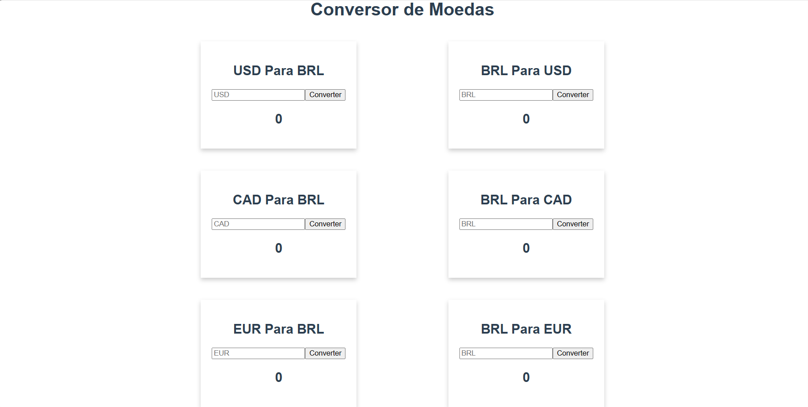

## Conversor de Moedas
## ✅Sobre o Projeto

[conversordemoedas.vercel.app](https://projeto-conversor-mu.vercel.app/)

Este é um projeto de conversor de moedas, o objetivo principal é permitir a conversão de valores entre as moedas Euro (EUR), Dólar Americano (USD) e Dólar Canadense (CAD) com base nas taxas de câmbio fornecidas por uma API gratuita.


## 🔗 Layout




## 💻 Tecnologia utilizadas

&nbsp;


## 📌 Como executar o projeto

```
# clonar o repositório
git clone https://github.com/Rayane-Souza/ProjetoConversor.git

# Entrar na pasta
 cd conversor

# Abrir o terminal 
 npm run serve
```


## Autora
Rayane Souza

<a href="https://www.linkedin.com/in/rayanekelly/" target="_blank"></a>

[def]: image.png